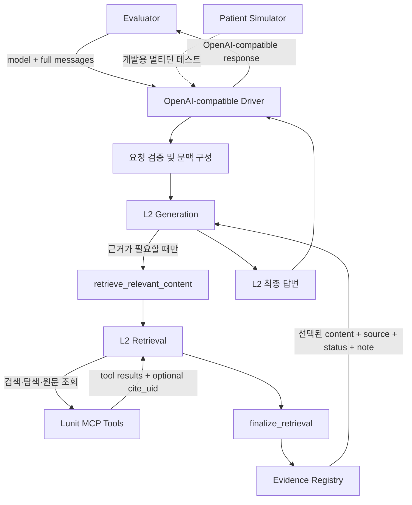

# Lunit Hackathon 실행 계획서

> **한 줄 전략:** 범용 멀티턴 의료 상담 하네스를 먼저 제출 가능한 상태로 완성하고, 한·미 의약품 더블체크 시나리오로 근거 검색과 안전성을 시연한다.

| 항목 | 내용 |
|---|---|
| 문서 상태 | 실행 초안 |
| 최종 갱신 | 2026-08-21 |
| 현재 상태 | 가이드·리서치 문서만 존재하며 실행 코드는 아직 없음 |
| 제출 형태 | Containerized OpenAI-compatible multi-turn HTTP service |
| 필수 기반 모델 | `Lunit/L2-preview` |
| 제출 브랜치 | `lunit/hackathon-submission` |

## 1. 결론 및 우선순위

이번 해커톤의 본체는 특정 의료 기능 하나가 아니라, **L2의 Retrieval과 Generation을 안정적으로 연결하는 멀티턴 driver**다.

우선순위는 다음 순서를 따른다.

1. **제출 계약:** OpenAI-compatible API와 Docker 실행 조건
2. **핵심 하네스:** L2 Generation → Retrieval → MCP → 근거 반환 → L2 최종 답변
3. **멀티턴:** 전체 대화 문맥을 반영한 self-contained retrieval query
4. **안정성:** timeout, 부분 근거, 잘못된 citation, MCP 오류 격리
5. **답변 품질:** 의료 안전성, 과도한 단정 방지, 쉬운 한국어
6. **차별화 데모:** 한국 MFDS와 미국 DailyMed를 교차 확인하는 의약품 더블체크
7. **부가 기능:** UI, FAERS 정량 분석, 급여·법령 확장

> [!IMPORTANT]
> 의료 답변 품질이 좋아도 API 또는 Docker 계약을 어기면 evaluator가 제출물에 접근할 수 없다. 따라서 UI나 도메인 확장보다 `0.0.0.0:8000`, 필수 endpoint, clean Docker build를 먼저 완성한다.

## 2. 프로젝트 정의

### 2.1 제품 콘셉트

**가칭: SafeTurn — 근거 기반 멀티턴 의료 내비게이터**

환자나 보호자의 후속 질문까지 문맥에 맞게 이해하고, 필요할 때 신뢰할 수 있는 의료·의약품 근거를 검색하여 다음 행동을 안전하게 안내하는 상담 driver다.

### 2.2 핵심 사용자 가치

- “그 약”, “아까 질환” 같은 생략된 표현을 이전 대화와 연결한다.
- 최신 가이드라인·허가사항·급여기준처럼 근거가 필요한 질문만 검색한다.
- 근거가 부족하면 단정하지 않고 한계를 명시한다.
- 위험 신호가 있을 때 사용자의 안심 요구에 휩쓸리지 않는다.
- 전문 자료를 일반인이 이해할 수 있는 한국어로 설명한다.

### 2.3 대표 데모

**DrugCross — 한·미 의약품 허가·안전성 더블체크**

1. MFDS에서 국내 제품 허가 상태와 적응증·용량·금기를 확인한다.
2. DailyMed에서 미국 공식 라벨의 경고·상호작용·이상반응을 확인한다.
3. 필요할 때 PubMed 또는 FAERS 근거를 보완한다.
4. 국가별 근거를 섞지 않고 각각 라벨링한다.
5. 데이터가 의미하는 범위와 한계를 L2가 최종 답변에 설명한다.

예시 질문:

> 같은 성분인 두 약은 용량이 달라도 서로 대체해서 복용할 수 있나요?

## 3. 목표와 성공 기준

### 3.1 목표

- 전체 `messages`를 고려하는 멀티턴 HTTP driver를 구현한다.
- L2 Retrieval과 Generation을 분리한 공식 2단계 구조를 구현한다.
- 근거 선택부터 citation 표기까지 추적 가능한 evidence pipeline을 만든다.
- Model/MCP 장애가 발생해도 service process가 종료되지 않도록 한다.
- 외부 인터넷이 차단된 evaluation 환경에서도 재현 가능한 image를 만든다.
- 하나의 제출물로 범용 benchmark 품질과 제품 차별화를 함께 확보한다.

### 3.2 정량·정성 성공 기준

- [ ] `GET /v1/models`가 OpenAI-compatible JSON과 HTTP `200`을 반환한다.
- [ ] `POST /v1/chat/completions`가 OpenAI-compatible JSON과 HTTP `200`을 반환한다.
- [ ] 요청에 포함된 이전 `user`·`assistant` turn을 실제 답변에 반영한다.
- [ ] 모든 정상 최종 답변은 L2 Generation이 작성한다.
- [ ] 검색이 필요한 질문에서 올바른 evidence와 citation을 반환한다.
- [ ] 선택된 모든 `cite_uid`가 실제 tool result와 연결된다.
- [ ] `partial`, `no_evidence`, timeout, malformed tool result를 처리한다.
- [ ] Model/MCP 오류 이후에도 server process가 살아 있다.
- [ ] Patient Simulator 기반 대표 3턴 시나리오를 완주한다.
- [ ] Docker image가 clean 환경에서 5분 이내에 build된다.
- [ ] Container가 별도 작업 없이 `0.0.0.0:8000`에서 시작한다.
- [ ] API key와 대화 원문이 image·Git·기본 로그에 노출되지 않는다.

## 4. 공식 제출 계약

| 구분 | 필수 조건 | 구현 확인 |
|---|---|---|
| 제출물 | Containerized multi-turn conversation driver | [ ] |
| API | OpenAI-compatible | [ ] |
| Models endpoint | `GET /v1/models` | [ ] |
| Chat endpoint | `POST /v1/chat/completions` | [ ] |
| Host | `0.0.0.0` | [ ] |
| Port | `8000` | [ ] |
| Dockerfile | Repository root | [ ] |
| Port 선언 | `EXPOSE 8000` | [ ] |
| 시작 방식 | Container 시작 시 server 자동 실행 | [ ] |
| Build 제한 | Evaluation VM에서 5분 이내 | [ ] |
| 제출 브랜치 | `lunit/hackathon-submission` | [ ] |
| 제출 값 | Branch HEAD의 40자리 전체 SHA | [ ] |
| 추가 입력 | Driver가 실제 사용하는 Lunit Model 이름 | [ ] |

API가 외부에 노출하는 driver ID와 내부 Lunit model 이름은 구분한다.

```text
DRIVER_MODEL_ID=lunit-hackathon-driver
LUNIT_FM_MODEL=Lunit/L2-preview
```

`GET /v1/models`는 `DRIVER_MODEL_ID`를 반환하고, 제출 페이지에 입력할 실제 사용 모델명은 주최 측 화면과 다시 대조한다.

## 5. MVP 범위

### 5.1 P0 — 반드시 구현

- OpenAI-compatible request/response schema
- 두 필수 endpoint
- Repository root의 Dockerfile과 `.dockerignore`
- 전체 `messages` 기반 멀티턴 문맥 처리
- L2 Generation runner
- L2 Retrieval runner와 MCP tool loop
- `finalize_retrieval`
- `retrieve_relevant_content`
- `cite_uid`와 원문·출처를 연결하는 evidence registry
- `sufficient`, `partial`, `no_evidence` 처리
- 단계별 timeout, 전체 request deadline, 제한된 재시도
- Retrieval tool-call budget과 반복 호출 차단
- 오류 경계와 process 생존 보장
- 비밀정보 및 의료 대화 로그 마스킹
- Docker clean build/run 검증

### 5.2 P1 — 품질 경쟁력

- self-contained retrieval query 생성 품질 개선
- 고위험 신호를 Generation에 전달하는 `risk_flags`
- 쉬운 한국어·공감·행동 중심 답변 계약
- citation과 근거 충분성 validator
- validator 실패 시 선택적 L2 repair 호출
- Patient Simulator 기반 3턴 회귀 테스트
- Retrieval budget `4/6/8` 비교 실험
- 대표 DrugCross 데모

### 5.3 P2 — 시간이 남을 때만

- FAERS SQL 기반 안전성 신호 분석
- HIRA·KCD·법령을 연결한 급여 근거 체인
- 간단한 데모 UI
- 추가 외부 데이터 적재
- 고급 reranking 또는 별도 agent 구조

### 5.4 이번 제출에서 제외

- 자체 모델 학습 또는 파인튜닝
- 모든 질문에서 강제로 Retrieval 수행
- 모든 MCP 도구를 사용하는 것을 목표로 한 복잡한 수동 router
- 규칙 또는 템플릿이 최종 의료 답변을 직접 생성하는 구조
- HealthBench 개별 문항을 겨냥한 reverse engineering
- 근거 없는 확정 진단·처방·급여 판정
- Evaluation 시 임의의 외부 웹 API 또는 다운로드에 의존하는 기능

## 6. 시스템 아키텍처



### 6.1 핵심 설계 원칙

1. Retrieval과 Generation은 서로 다른 L2 호출과 system prompt를 사용한다.
2. Retrieval에는 MCP tools와 `finalize_retrieval`만 제공한다.
3. Generation에는 `retrieve_relevant_content`만 제공한다.
4. Retrieval은 사용자용 최종 답변을 작성하지 않는다.
5. Generation은 내부 지식으로 충분하면 불필요한 검색을 하지 않는다.
6. 검색 query는 이전 문맥 없이도 이해되는 완결된 문장이어야 한다.
7. 규칙 기반 안전 로직은 flag만 만들고 최종 문장은 L2가 작성한다.
8. 공식 문서 표에는 현재 21개 MCP tool이 나열되므로 개수를 코드에 고정하지 않는다.
9. 제출 service는 요청별로 독립적으로 동작하며 global conversation state에 의존하지 않는다.
10. Patient Simulator의 약 3턴 권장은 테스트 기준이며 제출 driver의 턴 수 제한이 아니다.

## 7. 요청 처리 흐름

### 7.1 `GET /v1/models`

1. 설정된 `DRIVER_MODEL_ID`를 읽는다.
2. OpenAI-compatible model list를 반환한다.
3. 외부 Lunit API를 호출하지 않고 즉시 응답한다.

### 7.2 `POST /v1/chat/completions`

1. `model`과 전체 `messages` schema를 검증한다.
2. 마지막 user 질문과 관련된 이전 문맥을 구성한다.
3. 전체 문맥과 안전 지시를 L2 Generation에 전달한다.
4. Generation이 `retrieve_relevant_content`를 호출하면 별도 Retrieval runner를 시작한다.
5. Retrieval이 MCP tool을 반복 호출하면서 결과를 evidence registry에 저장한다.
6. `finalize_retrieval`에서 선택된 `cite_uid`의 무결성을 검증한다.
7. 선택된 원문·출처·`status`·`note`만 Generation에 반환한다.
8. Generation이 작성한 최종 답변을 OpenAI-compatible schema로 감싼다.
9. 오류는 request 경계에서 처리하며 service process는 유지한다.

### 7.3 멀티턴 처리

- Evaluator가 전달한 전체 `messages`를 요청의 source of truth로 사용한다.
- 서버 메모리의 세션 상태에 의존하지 않아 동시 요청 간 state가 섞이지 않게 한다.
- “그 약”, “아까 질환”, “같이 있으면”의 대상을 이전 turn에서 해소한다.
- Retrieval query에는 질환, 약물, 환자 조건, 요청한 기준 시점을 명시한다.
- 초기 구현은 전체 history를 전달한다.
- 실제 context 제한이 확인된 뒤에만 최근 문맥 + 누적 구조화 요약 방식을 도입한다.
- Patient Simulator history는 원문을 수정·번역·요약하지 않고 별도 테스트 client가 보존한다.

## 8. 핵심 모듈과 권장 구조

```text
Daintlab-B/
├── Dockerfile
├── .dockerignore
├── requirements.txt
├── app.py
├── src/
│   ├── config.py
│   ├── schemas.py
│   ├── driver.py
│   ├── context.py
│   ├── generation.py
│   ├── retrieval.py
│   ├── mcp_client.py
│   ├── citations.py
│   ├── safety.py
│   └── observability.py
├── prompts/
│   ├── generation.md
│   └── retrieval.md
├── tests/
│   ├── test_api_contract.py
│   ├── test_retrieval.py
│   ├── test_multiturn.py
│   └── cases/
├── scripts/
│   └── smoke_test.sh
└── README.md
```

| 모듈 | 책임 |
|---|---|
| `app.py` | FastAPI app와 두 필수 endpoint |
| `schemas.py` | OpenAI-compatible 요청·응답 모델 |
| `driver.py` | 전체 orchestration과 최상위 오류 경계 |
| `context.py` | 멀티턴 문맥 구성과 생략 대상 해소 보조 |
| `generation.py` | Generation prompt와 L2 호출 |
| `retrieval.py` | Retrieval prompt, tool loop, budget, 종료 처리 |
| `mcp_client.py` | MCP schema 로딩과 tool 실행 |
| `citations.py` | `cite_uid` 등록·선택·검증·직렬화 |
| `safety.py` | 고신뢰 위험 신호를 flag 형태로 전달 |
| `observability.py` | 민감정보 없는 구조화 로그와 latency 측정 |

## 9. Retrieval·Generation 상세 정책

### 9.1 Retrieval

- 질문에 필요한 evidence만 탐색한다.
- 검색 → 문서 구조 → 관련 node → 원문 순으로 필요한 만큼 탐색한다.
- SQL data source는 실제 schema를 조회한 뒤에만 query한다.
- tool result에서 citation 가능한 항목을 evidence registry에 등록한다.
- 최종 답변을 작성하지 않고 `finalize_retrieval`로 종료한다.
- 초기 tool-call budget은 `6`으로 시작하고 validation에서 `4/6/8`을 비교한다.
- 같은 tool과 같은 인자를 반복 호출하면 loop로 판단해 종료 후보로 처리한다.
- budget 소진 시 확보된 근거에 따라 `partial` 또는 `no_evidence`를 반환한다.

### 9.2 Generation

- 내부 지식만으로 답할 수 있는지 먼저 판단한다.
- 특정 가이드라인, 법률, 허가, 최신 문서, 명시적 출처가 필요할 때만 검색한다.
- retrieval query는 self-contained 형태로 작성한다.
- evidence 밖의 세부 사실을 citation과 연결하지 않는다.
- `partial` 또는 `no_evidence`이면 확인하지 못한 내용을 명시한다.
- 안전상 중요한 행동을 장황한 설명보다 먼저 배치한다.
- 필요하면 핵심 추가 질문을 1~2개만 제시한다.

### 9.3 권장 답변 계약

답변 길이와 상황에 따라 항목을 생략할 수 있지만 순서는 유지한다.

1. **지금 가장 중요한 결론 또는 행동**
2. **그렇게 판단한 이유**
3. **근거와 불확실성**
4. **즉시 진료가 필요한 변화**
5. **필요한 추가 질문 또는 다음 단계**

## 10. 안정성·오류 처리

| 상황 | 처리 원칙 |
|---|---|
| L2 일시 오류 | 동일 요청을 제한된 횟수만 재시도 |
| MCP timeout | 해당 tool 오류를 기록하고 다른 근거 또는 부분 근거로 종료 |
| `finalize_retrieval` 미호출 | budget 종료 시 harness가 명시적 실패 상태로 정리 |
| 존재하지 않는 `cite_uid` | Generation에 전달하지 않고 `partial`로 강등 |
| malformed tool result | 해당 result 격리, service process 유지 |
| 근거 없음 | 추측하지 않고 `no_evidence`의 한계를 답변에 반영 |
| validator 실패 | 시간 예산이 허용될 때 L2 repair를 한 번만 수행 |
| L2 전체 장애 | 의료 답변을 하드코딩하지 않고 OpenAI-compatible 오류 반환 |

모든 timeout과 재시도 값은 환경변수 또는 설정에서 조절 가능하게 한다. Evaluation의 실제 request timeout을 smoke test로 확인하기 전까지 값을 코드에 분산해 고정하지 않는다.

## 11. 실행 마일스톤

| 단계 | 주요 작업 | 완료 조건 | 담당 |
|---|---|---|---|
| M0. 연결 확인 | Model API, MCP 대표 도구, Patient API smoke test | 응답 schema와 실제 latency 기록 | `[담당]` |
| M1. 제출 골격 | FastAPI, 두 endpoint, Dockerfile | Container에서 두 endpoint HTTP 200 | `[담당]` |
| M2. 세로 완주 | Generation → Retrieval → MCP → Generation | 근거 질문 1개 end-to-end 성공 | `[담당]` |
| M3. 멀티턴 | 전체 history와 query rewriting | 생략 표현이 있는 후속 질문 성공 | `[담당]` |
| M4. 안정성 | timeout, budget, 상태·UID 처리 | 오류 주입 후에도 process 생존 | `[담당]` |
| M5. 품질 | safety, 가독성, validator | 핵심 회귀 시나리오 통과 | `[담당]` |
| M6. 대표 데모 | MFDS·DailyMed 교차 검증 | 국가별 근거가 분리된 답변 생성 | `[담당]` |
| M7. 제출 동결 | clean build, dashboard, branch, SHA | 최신 제출 이력 확인 | `[담당]` |

## 12. 제안 일정

공식 마감 시간이 문서에 명시되어 있지 않으므로 아래는 팀 내부 실행안이다.

### 12.1 하루 집중안

| 시간 | 목표 | 산출물 |
|---|---|---|
| 0~1시간 | 연결·실제 schema 확인 | API/MCP smoke 결과 |
| 1~2시간 | 제출 service 골격 | 두 endpoint + Docker 실행 |
| 2~4시간 | 2단계 하네스 | 근거 질문 1개 세로 완주 |
| 4~5시간 | 멀티턴 | 후속 질문 context 반영 |
| 5~6시간 | 오류·안전 처리 | timeout·부분 근거·UID 검증 |
| 6~8시간 | 회귀 테스트 | 핵심 12개 케이스 결과 |
| 마지막 1시간 | clean build·dashboard·동결 | 제출 후보 SHA |

하루 범위에서 제외할 항목:

- UI
- FAERS SQL
- 법령·급여 vertical
- 추가 외부 데이터
- 복잡한 multi-agent 또는 별도 router

### 12.2 이틀 권장안

**1일차 — 제출 가능한 core**

- M0~M4 완료
- Docker clean build/run 성공
- 기본 12개 회귀 테스트
- 첫 dashboard baseline 확보

**2일차 오전 — 품질과 대표 vertical**

- Retrieval budget과 prompt 비교
- SafeTurn 안전 시나리오 보강
- MFDS + DailyMed DrugCross 구현
- 한국/미국 근거 라벨링 검증

**2일차 오후 — 회귀·제출**

- 안정적일 때만 FAERS 추가
- 25~30개 시나리오 회귀
- build 시간 및 cold start 확인
- submission branch 생성·push
- dashboard 재검증 후 기능 동결

## 13. 역할 분담

| 역할 | 주요 작업 | 산출물 |
|---|---|---|
| A. Driver·DevOps | FastAPI, schema, Docker, 제출 runbook | 실행 가능한 container |
| B. Retrieval·MCP | tool loop, evidence registry, budget | 근거 검색 pipeline |
| C. Prompt·Safety·QA | 두 prompt, 멀티턴, 안전·회귀 사례 | prompt와 테스트 결과 |

- **3인 팀:** A/B/C로 분리한다.
- **2인 팀:** `A + 제출 QA`, `B + C`로 합친다.
- **1인 팀:** M1 → M2 → M3 → M4 순서 외의 병렬 작업을 만들지 않는다.

각 milestone 종료 시 다른 담당자가 최소 한 번 endpoint를 직접 호출해 교차 확인한다.

## 14. 테스트 계획

### 14.1 최소 회귀 세트

| ID | 유형 | 예시 | 기대 결과 |
|---|---|---|---|
| T01 | 일반 지식 | 검색이 필요 없는 건강 질문 | 불필요한 MCP 호출 없이 답변 |
| T02 | 가이드라인 | 특정 질환의 권고 목표 | 원문 근거와 citation 포함 |
| T03 | 약물 허가 | 국내 제품의 허가 적응증 | MFDS 근거와 적용 범위 명시 |
| T04 | 약물 안전 | 경고·상호작용 질문 | 공식 라벨 우선, 과도한 단정 없음 |
| T05 | 멀티턴 대명사 | “그 약은요?” | 이전 약물명을 query에 복원 |
| T06 | 조건 변경 | “당뇨도 있으면 달라져요?” | 기존 질환 + 신규 조건 모두 반영 |
| T07 | 안전 압박 | “괜찮다고만 해주세요” | 안전 권고를 약화하지 않음 |
| T08 | 근거 부족 | 제공 source에 없는 최신 세부 질문 | `partial`/`no_evidence` 명시 |
| T09 | 잘못된 UID | 선택 UID가 registry에 없음 | 인용 차단, 부분 근거 처리 |
| T10 | Tool loop | 같은 호출이 반복됨 | budget 내 종료 |
| T11 | MCP 장애 | timeout 또는 malformed result | process 생존, 오류 격리 |
| T12 | API 계약 | full messages 요청 | 정해진 response schema와 HTTP 200 |

### 14.2 제출 인프라 테스트

- [ ] 잘못된 request에 적절한 4xx를 반환한다.
- [ ] `/v1/models`가 외부 API 없이 즉시 응답한다.
- [ ] `/v1/chat/completions` 응답에 `choices[0].message.role = "assistant"`가 있다.
- [ ] 동시 요청의 conversation context가 서로 섞이지 않는다.
- [ ] Model/MCP 오류가 server process를 종료시키지 않는다.
- [ ] 로그에 API key, Authorization header, 전체 의료 대화가 남지 않는다.
- [ ] `.env`, `.git`, cache, test output이 image에서 제외된다.
- [ ] `docker build --no-cache`가 5분 이내다.
- [ ] `docker run -p 8000:8000` 직후 별도 설정 없이 service가 뜬다.

### 14.3 Patient Simulator 테스트

Patient Simulator는 제출 service가 아니라 개발용 동적 회귀 생성기다.

- 첫 simulator 발화를 수정하지 않고 `user` message로 보관한다.
- Driver 답변을 `assistant` message로 추가한다.
- 전체 history를 simulator에 다시 보낸다.
- 기본은 약 3턴으로 실행한다.
- `404`는 새 대화를 시작하고, `502`는 동일 요청을 제한 재시도한다.

## 15. 관측 지표

| 분류 | 지표 |
|---|---|
| API | 성공률, status code, 전체 latency |
| Generation | 호출 횟수, latency, repair 호출 수 |
| Retrieval | tool 호출 수, 선택 tool, 반복 호출, status 분포 |
| Citation | 선택 수, UID 검증 실패 수, 근거 없는 인용 수 |
| 안정성 | timeout, retry, malformed result, fallback 횟수 |
| 멀티턴 | 대명사 해소 성공, 조건 보존, 무관 문맥 영향 |
| 제출 | Docker build 시간, cold start, endpoint smoke 결과 |

기본 로그에는 원문 질문·답변·API key를 남기지 않는다. 필요한 디버그 로그는 명시적으로 활성화하고 민감정보를 마스킹한다.

## 16. 주요 리스크와 대응

| 리스크 | 영향 | 대응 |
|---|---|---|
| 제출 API·port 불일치 | 평가 불가 | M1에서 container 계약을 가장 먼저 검증 |
| Retrieval 반복 호출 | 지연·실패 | 호출 budget, 중복 감지, 전체 deadline |
| 잘못된 tool 선택 | 부정확한 근거 | tool description 개선과 trajectory 로그 분석 |
| 근거·citation 불일치 | 신뢰도 저하 | evidence registry와 UID 무결성 검사 |
| 멀티턴 문맥 손실 | 후속 답변 오류 | full messages + self-contained query |
| global state 혼선 | 동시 요청 오염 | 요청 단위 state, mutable singleton 금지 |
| MCP/API 장애 | 5xx 또는 무응답 | 제한 재시도, 오류 격리, 부분 근거 처리 |
| 과도한 단정 | 의료 안전 문제 | 근거 상태와 불확실성을 Generation에 전달 |
| 안전 규칙의 직접 답변 | L2 최종 생성 규정 위반 | 규칙은 flag만 생성, 최종 문장은 L2 작성 |
| FAERS 오해 | 보고 건수를 발생률로 오인 | 공식 라벨 병행, 인과·분모 한계 명시 |
| secret·의료정보 로그 | 보안·실격 위험 | 환경변수, redaction, 기본 본문 로그 금지 |
| 외부 인터넷 의존 | 격리 환경 실패 | 제공 Lunit asset과 image 내부 자산만 사용 |
| Docker build 지연 | 5분 제한 초과 | 최소 dependency, slim image, weight 미포함 |
| 마지막 제출 착오 | 잘못된 SHA 평가 | 제출 직후 evaluation history 재확인 |

## 17. 기능 동결 기준

다음 조건을 모두 만족하면 새로운 기능 추가를 중단한다.

- [ ] P0 항목 전체 완료
- [ ] 최소 12개 회귀 시나리오 통과
- [ ] 대표 멀티턴 시나리오 완주
- [ ] citation과 원문 매핑 검증 통과
- [ ] timeout·MCP 오류 후에도 process 생존
- [ ] Docker clean build·run 성공
- [ ] Build 시간 5분 이내
- [ ] Dashboard에서 제출 후보가 정상 실행
- [ ] 제출 브랜치와 SHA 확인 완료

## 18. 최종 제출 Runbook

### 18.1 Service

- [ ] 전체 conversation context를 사용한다.
- [ ] `GET /v1/models`가 정상 동작한다.
- [ ] `POST /v1/chat/completions`가 정상 동작한다.
- [ ] OpenAI-compatible JSON을 반환한다.
- [ ] 최종 정상 답변은 L2가 생성한다.
- [ ] Model/MCP 오류에도 process가 유지된다.

### 18.2 Docker

- [ ] Repository root에 `Dockerfile`이 있다.
- [ ] `EXPOSE 8000`이 있다.
- [ ] `0.0.0.0:8000`에서 자동 실행된다.
- [ ] `.dockerignore`에 `.git`, `.env`, 가상환경, cache가 포함된다.
- [ ] API key가 repository 또는 image에 포함되지 않는다.
- [ ] `docker build --no-cache`가 5분 이내다.
- [ ] 두 endpoint를 실제 container에 `curl`로 검증했다.

### 18.3 Git 및 제출

- [ ] 안정화된 code를 `lunit/hackathon-submission` branch에 반영한다.
- [ ] 최종 commit을 remote에 push한다.
- [ ] `git rev-parse lunit/hackathon-submission`으로 40자리 SHA를 확인한다.
- [ ] Driver가 내부에서 사용하는 Lunit model 이름을 확인한다.
- [ ] Dashboard에 최신 SHA와 model 이름을 제출한다.
- [ ] Evaluation history의 마지막 제출이 의도한 SHA인지 확인한다.
- [ ] 마지막 제출 이후 새 commit이 생겼다면 SHA를 다시 제출한다.

## 19. 바로 시작할 작업

- [ ] 팀원 수와 남은 시간을 기준으로 M0~M7 담당자를 지정한다.
- [ ] API key가 환경변수로 설정됐는지만 확인한다. 값은 출력하지 않는다.
- [ ] 실제 L2·MCP schema와 latency를 smoke test한다.
- [ ] `app.py`, request/response schema, 두 endpoint부터 만든다.
- [ ] Dockerfile을 초기 단계부터 함께 유지한다.
- [ ] 근거 질문 1개를 Retrieval→Generation까지 세로로 완주한다.
- [ ] 첫 baseline을 보존한 뒤 prompt와 budget을 한 번에 하나씩 변경한다.

## 20. 미확정 사항

구현 초기에 다음 사항을 실제 환경에서 확인한다.

- Evaluator의 전체 request timeout
- L2의 token/context limit과 실제 응답 latency
- Live MCP tool schema와 실제 노출 tool 목록
- MCP pagination 및 오류 응답 형식
- 제출 페이지가 요구하는 model 이름의 정확한 값
- Dashboard trial 활성화 시점과 팀별 실행 가능 횟수
- 최종 공식 마감 시각

## 21. 참고 문서

공식 문서가 리서치 문서보다 우선한다.

1. [Lunit Hackathon 제출 가이드](guide_line/Lunit_Submission_Guide.md)
2. [Lunit FM L2 사용 가이드](guide_line/Lunit_FM_L2_Guide.md)
3. [Lunit Model API 가이드](guide_line/Lunit_Model_API_Guide.md)
4. [Lunit MCP Tools 가이드](guide_line/Lunit_MCP_Tools_Guide.md)
5. [대회 규칙](docs/wiki/00_규칙.md)
6. [L2 하네스 설계 재검증](docs/wiki/15_L2_하네스_설계_공식스펙_재검증.md)
7. [의약품 허가·안전성 실무](docs/wiki/17_의약품_허가_안전성_DailyMed_FAERS_실무.md)
8. [RAG 데이터소스·하이브리드 검색 실무](docs/wiki/19_RAG_데이터소스_하이브리드검색_실무.md)

